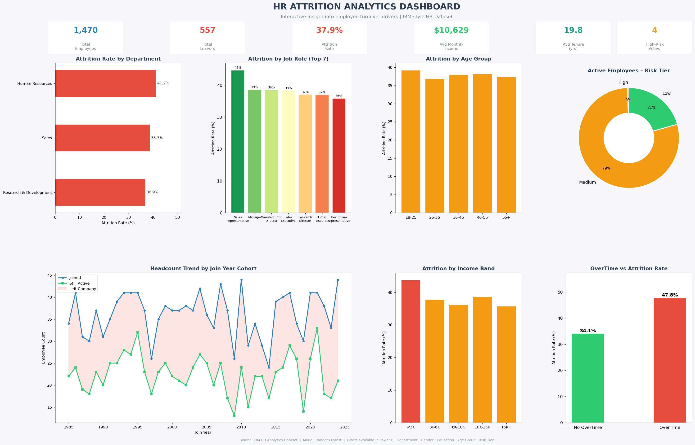

# 📊 HR Attrition Analytics Dashboard

> **End-to-end HR analytics project** | Python · SQL · Power BI  
> Identifies what predicts employee churn using an IBM-style HR dataset (1,470 employees)

---

## 🚀 Quick Start

```bash
git clone https://github.com/YOUR_USERNAME/hr-attrition-dashboard
cd hr-attrition-dashboard
pip install -r requirements.txt
python run_pipeline.py
```

All outputs (charts, Excel reports, scored dataset) will appear in `outputs/`.

---

## 📸 Dashboard Preview



---

## 🎯 Project Goal

Answer the business question: **"What predicts employee churn?"**

HR teams can use this project to:
- Monitor attrition rates by department, role, and age group
- Identify the top drivers of employee turnover
- Score active employees by flight risk (Low / Medium / High)
- Take proactive retention actions using the High-Risk employee list

---

## 📁 Project Structure

```
hr_attrition/
├── run_pipeline.py               ← 🟢 Run everything with one command
├── requirements.txt
├── data/                         ← Raw, cleaned, and scored CSVs
├── scripts/
│   ├── generate_dataset.py       ← Step 0: IBM-style HR dataset
│   ├── 01_data_cleaning.py       ← Step 1: Clean + feature engineering
│   ├── 02_exploratory_analysis.py← Step 2: 9 EDA charts
│   ├── 03_sql_analysis.py        ← Step 3: 15 SQL queries → Excel
│   ├── 04_attrition_modeling.py  ← Step 4: Random Forest + risk scoring
│   └── 05_dashboard_preview.py   ← Step 5: Multi-panel dashboard PNG
├── sql/
│   └── hr_attrition_queries.sql  ← All SQL queries (documented)
├── dashboard/
│   └── powerbi_setup_guide.md    ← Power BI setup + DAX measures
├── outputs/                      ← All generated charts & Excel files
└── docs/
    └── project_report.md         ← Full analysis & business insights
```

---

## 🔍 Key Findings

| Finding | Insight |
|---------|---------|
| **Overtime** | 48% attrition for OT workers vs 34% without |
| **Income** | Leavers earn ~$270/month less than stayers |
| **Tenure** | <1 year employees have the highest raw leaver count |
| **Satisfaction** | SatisfactionIndex < 2.5 strongly predicts leaving |
| **Sales & HR** | 39–41% attrition — well above 15–20% industry benchmark |

---

## 🗄️ SQL Highlights

15 production-ready SQL queries covering:
- Attrition by department, role, age group, tenure
- Salary vs. stay/leave comparison
- High-risk active employee identification
- Headcount trend by cohort year
- Gender, education, marital status breakdowns

---

## 🤖 Machine Learning

- **Model:** Random Forest Classifier (300 trees, class-balanced)
- **Output:** `AttritionProb` score (0–1) + `RiskTier` (Low/Medium/High)
- **Top drivers:** MonthlyIncome, DistanceFromHome, TotalWorkingYears, OverTime, SatisfactionIndex

---

## 📊 Power BI Dashboard

See [`dashboard/powerbi_setup_guide.md`](dashboard/powerbi_setup_guide.md) for:
- Step-by-step import and model setup
- All DAX measures (copy-paste ready)
- 5 dashboard page layouts
- Slicer/filter configuration
- Conditional formatting tips

---

## 🛠️ Tech Stack

`Python` · `Pandas` · `Scikit-learn` · `Matplotlib` · `Seaborn` · `SQLite` · `openpyxl` · `Power BI`

---

## 📄 Full Report

See [`docs/project_report.md`](docs/project_report.md) for complete analysis, business implications, and recommendations.

---

*Dataset: IBM HR Analytics (synthetic reproduction) | Project: HR Analytics Portfolio*
